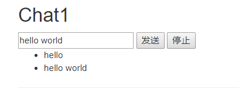
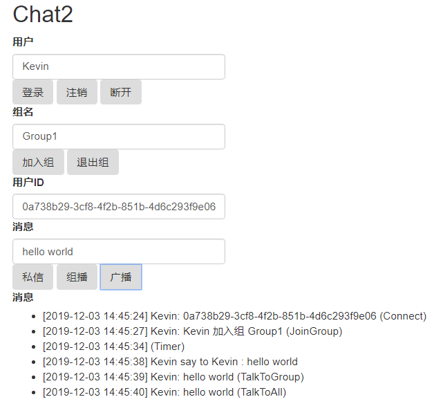

# About

Asp.NET MVC SignalR 聊天示例程序

# Author

<http://github.com/surfsky/TestSignalR>

# 功能
- [x] 连接（关联用户名和ConnectionID）
- [x] 退出
- [x] 加入组
- [x] 退出组
- [x] 发送给发送人
- [x] 发送给指定人
- [x] 发送给组
- [x] 发送给全体
- [x] 发送文本
- [x] 服务器端主动给客户端发消息
- [ ] 发送图片： 参考 http://www.cppcns.com/wangluo/aspnet/147133.html， 用base64传递图片

# 截图

- 简单聊天

- 完整聊天

# More

[Jabbr](https://github.com/JabbR/JabbR) , SignalR 作者写的聊天室程序。