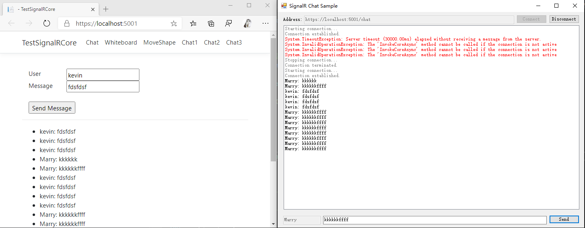
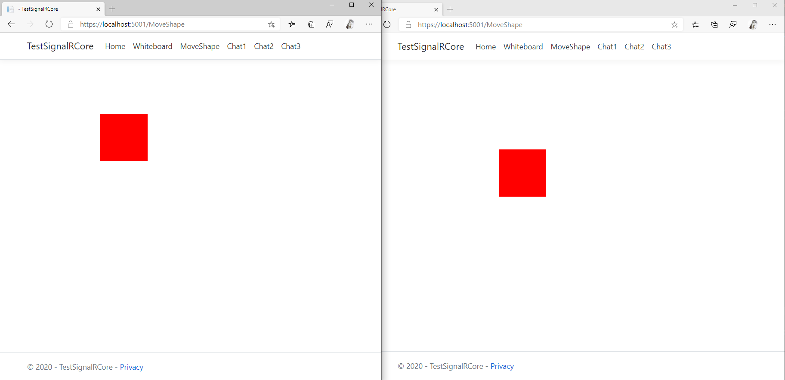
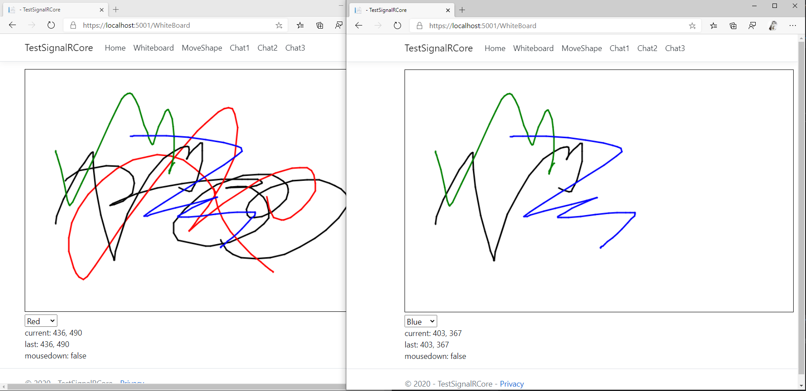

# About

SignalR webform, mvc, aspnetcore, windowform 聊天示例程序

- http://github.com/surfsky/TestSignalR
- http://surfsky.github.com
- http://surfsky.cnblogs.com

LastUpdate: 2020-05

# 功能

## Chat 功能
- [x] 发送
- [x] 广播
- [x] 接收广播并显示

## 绘图功能
- [x] 拖动同步
- [x] 绘图同步

## IM 功能
- [x] 连接（关联用户名和ConnectionID）
- [x] 退出
- [x] 加入组
- [x] 退出组
- [x] 发送给发送人
- [x] 发送给指定人
- [x] 发送给组
- [x] 发送给全体
- [x] 发送文本
- [x] 服务器端主动给客户端发消息
- [ ] 发送图片： 参考 http://www.cppcns.com/wangluo/aspnet/147133.html， 用base64传递图片

# 截图

- 简单聊天

- 完整聊天

- WindowForm 联动

- 拖动

- 白板绘图

# History

2020-05
+ 增加 Aspnetcore 3.1 项目（API 变化了很多）
+ 增加 Window Form signalr 项目
+ App.Chats 改为代码共享项目

2019-12
- 拆出项目 App.Chats
- 增加项目 Asp.net signalR WebForm 
- 解决跨域问题

# Reference

- https://dotnet.microsoft.com/apps/aspnet/signalr
- https://docs.microsoft.com/zh-cn/aspnet/core/tutorials/signalr?tabs=visual-studio&view=aspnetcore-3.1
- [Jabbr](https://github.com/JabbR/JabbR) , SignalR 作者写的聊天室程序。

